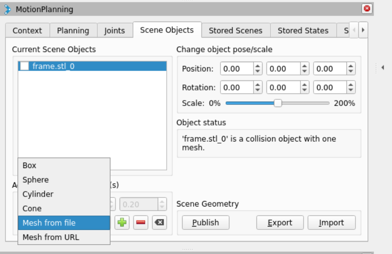

# 如何往moveit的规划场景中添加场景几何碰撞体

添加简单的几何形状，比如方块，圆柱体等可以follow下面的教程，非常清楚。
- https://moveit.picknik.ai/main/doc/examples/move_group_interface/move_group_interface_tutorial.html#adding-objects-to-the-environment

```cpp{.line-numbers}
moveit_msgs::msg::CollisionObject collision_object;
collision_object.header.frame_id = move_group.getPlanningFrame();

// The id of the object is used to identify it.
collision_object.id = "box1";

// Define a box to add to the world.
shape_msgs::msg::SolidPrimitive primitive;
primitive.type = primitive.BOX;
primitive.dimensions.resize(3);
primitive.dimensions[primitive.BOX_X] = 0.1;
primitive.dimensions[primitive.BOX_Y] = 1.5;
primitive.dimensions[primitive.BOX_Z] = 0.5;

// Define a pose for the box (specified relative to frame_id).
geometry_msgs::msg::Pose box_pose;
box_pose.orientation.w = 1.0;
box_pose.position.x = 0.6;
box_pose.position.y = 0.0;
box_pose.position.z = 0.10;

collision_object.primitives.push_back(primitive);
collision_object.primitive_poses.push_back(box_pose);
collision_object.operation = collision_object.ADD;

std::vector<moveit_msgs::msg::CollisionObject> collision_objects;
collision_objects.push_back(collision_object);

// Now, let's add the collision object into the world
// (using a vector that could contain additional objects)
RCLCPP_INFO(LOGGER, "Add an object into the world");
planning_scene_interface.addCollisionObjects(collision_objects);
```

我这里想要了解的是如何添加mesh，比如stl文件，来表达形状复杂的碰撞体

这一操作在 `rviz` 界面上可以很方便的实现，只需要点击 `Scene Objects` 下面的 `Add/Remove scene object`，选择` Mesh from file` 就可以了。


## 如何通过程序实现
