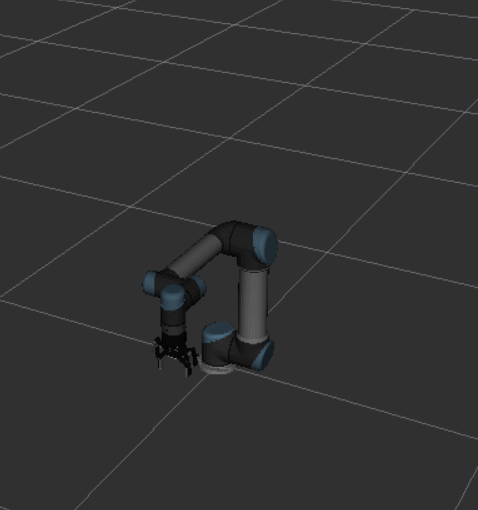
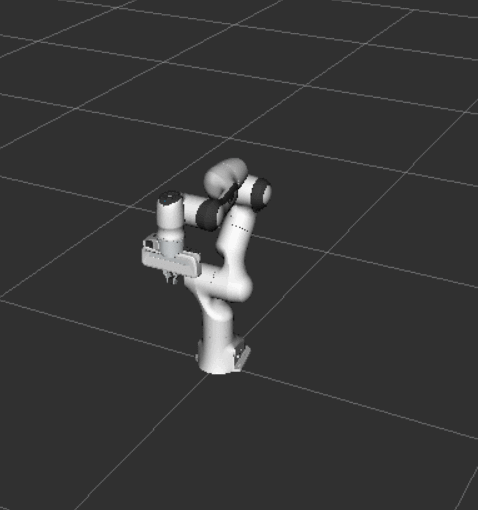

# 如何进行精准运动规划
> 是为了让UR机器人尽量走捷径，不要走那些远路，下面是个明显对比

## 当前效果

| UR Robot                        | Panda Robot                        |
| ------------------------------- | ---------------------------------- |
|  |  |

同样follow这个[tutorial](https://moveit.picknik.ai/main/doc/examples/motion_planning_api/motion_planning_api_tutorial.html)来做的，但是UR明显在走远路，但是panda的轨迹就很好，非常的捷径。

我需要搞清楚这是为什么。

现在已经问了一个问题：https://robotics.stackexchange.com/questions/113562/issues-with-motion-planning-path-on-ur-robot-using-moveit-api-tutorial

有一个人回答说让我做插值，但是效果仍然不行，做了插值，每个姿态之间的距离差异很小了，还是会绕远路。

## 遇到的问题总结

### 1. Moveit Setup Assistant 并未生成 `ompl_planning.yaml`文件

MSA 2.0 并不会像1那样自动生成该文件，参考[[1]](https://github.com/moveit/moveit2/issues/2256) [[2]](https://github.com/moveit/moveit2/issues/2265)。

这个文件是用来在moveit 里面设置OMPL里面的规划器的，如果不设置就无法使用，在plan的时候rviz中的ompl planner下面会不显示规划器，只有一个unspecified.

但是这个文件只是配置而已，ompl都是安装了的。

与Moveit1所使用的ompl_planning.yaml文件不同，这文件的开头需要加上

```yaml{.line-numbers}
planning_plugin: ompl_interface/OMPLPlanner
request_adapters: >-
  default_planner_request_adapters/AddTimeOptimalParameterization
  default_planner_request_adapters/ResolveConstraintFrames
  default_planner_request_adapters/FixWorkspaceBounds
  default_planner_request_adapters/FixStartStateBounds
  default_planner_request_adapters/FixStartStateCollision
  default_planner_request_adapters/FixStartStatePathConstraints
```

这个在上面的两个回答里面都有说明。

其余的部分都和Moveit1基本一样。

### 2. 添加 `ompl_planning.yaml`后机器人规划失败
我原先没有这个文件，一直都是unspecified，但是大部分规划也能成功。添加了这个之后，我自己写的 robot_function_test node反而规划不成功了。甚至在rviz里面规划都会失败。

会报这个错误：
```bash{.line-numbers}

[move_group-4] Skipping adapter instead.
[move_group-4] [WARN] [1730596255.145292513] [ompl]: ./src/ompl/base/goals/src/GoalLazySamples.cpp:129 - Goal sampling thread never did any work. Space information not set up.
[move_group-4] [ERROR] [1730596255.145507179] [moveit.planning_request_adapter]: Exception caught executing adapter 'Fix Start State In Collision': bad lexical cast: source type value could not be interpreted as target
[move_group-4] Skipping 
```

后面发现应该是位姿确实达不到。

### 3. 程序上在哪里设置和切换不同的planner
rviz里面的规划可以通过下拉菜单来选择，程序上呢，如果只是能够通过修改 ompl_planning.yaml来改的话，运行过程中如何切换呢？

### 4. tutorial跟实际规划的不同之处
实际规划用的更多的是封装好的move_group_interface。现在我也在测试。

### 5. 为何我的姿态无法在预览直接走
现在测试move_group_interface这个，发现panda可以不考虑实际位置，直接从预览位置进行规划模拟，我的上来就会规划失败，明明起始位置可以到的。

> 破案了，是因为我设置的目标姿态超出了我所设置的joint limits的范围，这个在erorr message里面是可以看到的。

### 6. Move group interface的demo是怎么只规划不走的
而且还显示设计好的轨迹